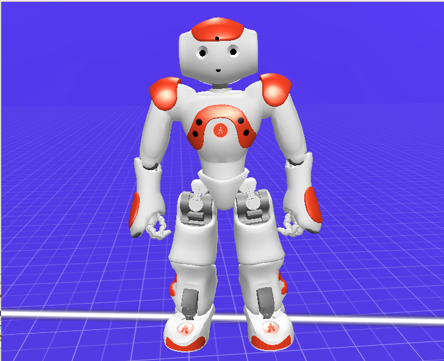

# NOA-robot-simulation

Noa robot is type of humanoid robot having 25 DOF(degree of freedom).
I have use Choregraphe 2.1.4 to simulate Noa robot.I have use virtual noa for simulation.
In this simulation noa waves hand and wants to be your friend.

Download link of Choregraphe 2.1.4:
https://www.softbankrobotics.com/emea/en/support/nao-6/downloads-softwares/former-versions?os=45&category=39

My Contact:

email id: vermahrithik10@gmail.com

Direct message me at instagram:https://www.instagram.com/hrithik.verma.100/?hl=en
